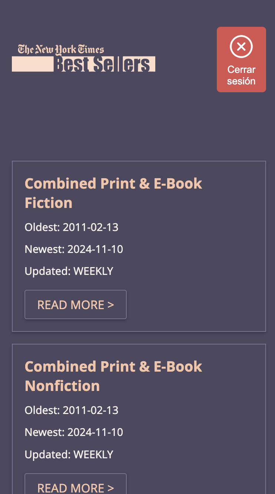
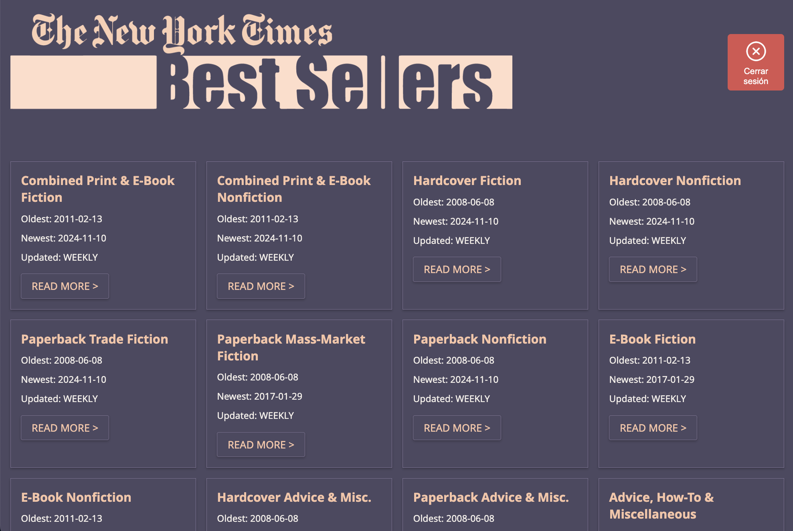

# Biblioteca Dinámica 📚 Manipulación de DOM y Autenticación con Firebase

Este proyecto es un dashboard de biblioteca que permite a los usuarios explorar y gestionar una lista de libros a través de una integración dinámica con la API de Libros del NY Times. Permite a los usuarios explorar diferentes listas de libros y acceder a información detallada, como posiciones en el ranking, descripciones, enlaces de compra, y más.

## 🌐 Despliegue en GitHub Pages

Puedes acceder a la versión en vivo del proyecto en el siguiente enlace:  
[Ver Biblioteca Dashboard en GitHub Pages](https://jhonybe77.github.io/Biblioteca/)

## Características
- **Interfaz dinámica en tiempo real**: Actualización automática de contenido desde la API de Libros del NY Times, con datos como posiciones en el ranking, descripciones, imágenes y enlaces de compra.
- **Diseño responsivo y Mobile-First**: Optimizado para diferentes tamaños de pantalla, usando HTML5 semántico.
- **Gestión de Favoritos**: Los usuarios pueden autenticarse con Firebase Auth para guardar y acceder a una lista personalizada de libros favoritos.
- **Autenticación de Usuarios**: Firebase Authentication permite una experiencia segura y personalizada.
- **Animación de carga**: Mejora la experiencia del usuario mientras se carga el contenido.
- **Buenas prácticas y control de versiones**: Código limpio y organizado, gestionado desde GitHub con ramas para cada funcionalidad.

## 🚀 Requisitos del Proyecto
Este proyecto fue desarrollado siguiendo estas pautas:

1. **Manipulación dinámica del DOM**: La interfaz se actualiza con JavaScript para reflejar los cambios del usuario sin necesidad de recargar la página.
2. **Uso de ES6+**: Funcionalidades modernas de JavaScript como `let`, `const`, funciones de flecha, y destructuring.
3. **Manejo asincrónico**: `async/await` y `fetch` para operaciones asincrónicas, particularmente para interactuar con Firebase y la API de Libros.
4. **Sin frameworks o librerías externas**: Mantener el código limpio y sin dependencias, excepto Firebase para autenticación y almacenamiento.
5. **Control de versiones en GitHub**: Desarrollo con ramas desde el inicio, utilizando Git y GitHub.
6. **Código limpio y buenas prácticas**: Organización y limpieza del código para facilitar su comprensión y mantenimiento.
7. **Diseño Mobile-First**: Prioridad en el diseño para móviles, adaptado a pantallas grandes mediante media queries y flexbox.
8. **HTML5 semántico**: Uso de etiquetas semánticas para mejorar la accesibilidad y el SEO.

## Especificaciones
Este proyecto está en su segunda fase de desarrollo, con funcionalidades avanzadas a través de Firebase y una integración completa con la API de Libros:

- **Autenticación y Personalización con Firebase**: Los usuarios pueden registrarse, iniciar sesión y, al autenticarse, acceder a funciones adicionales como guardar libros favoritos.
- **Almacenamiento de Favoritos en Firebase Firestore**: Los favoritos de cada usuario se guardan en una base de datos segura en Firebase.
- **Integración de API Dinámica**: Datos en tiempo real desde la API de Libros del NY Times, que incluyen descripción detallada, imagen de portada, posición en el ranking y enlaces de compra.

## 📸 Vistas del Proyecto

Aquí tienes algunas capturas de pantalla de la aplicación:

<p align="center">
  
  
  
</p>

<p align="center">
  
  
</p>


## 📁 Estructura del Proyecto

La estructura del proyecto es la siguiente:

```plaintext
├── index.html              # Página principal del proyecto
├── css/
│   └── styles.css          # Archivo de estilos CSS
├── js/
│   └── script.js           # Lógica y funciones de JavaScript
├── assets/
│   └── img/                # Carpeta de imágenes utilizadas como iconos
│       └── icono1.png      # Ejemplo de icono
└── README.md               # Documentación del proyecto
```

## 🛠️ Instalación y Uso

1. Clona el repositorio: `git clone <URL del repositorio>`
2. Instala Firebase en el proyecto: `npm install firebase`
3. Configura Firebase Authentication y Firestore en tu proyecto de Firebase.
4. Abre `index.html` en tu navegador para visualizar la aplicación.

## ✨ Mejoras Futuras

- **Sistema de Favoritos Expandido**: Agregar una página donde el usuario pueda ver y gestionar sus libros favoritos.
- **Firebase Cloud Storage**: Permitir a los usuarios subir fotos de perfil, almacenando la URL en su documento de Firestore.
